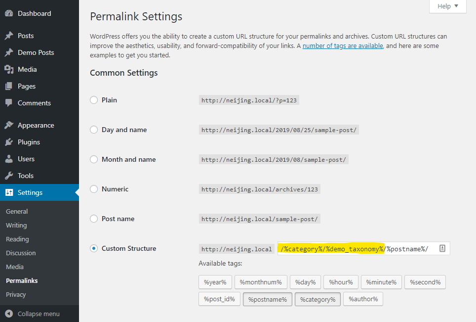

# Modern Primary Category
Gutenberg-friendly primary category plugin -- the easiest way to choose a category to be used in post's permalink.

## Features
* Enables taxonomy placeholders in permalinks;
* Supports custom post types and custom taxonomies;
* Allows multiple taxonomies in post's permalink.


## Limitations
* Works only on hierarchical taxonomies (i.e. does not work on tags);
* No user interface for Classical Editor.

## Instructions

### Support for Custom Post Types
To have Gutenberg/Block Editor enabled for your CPTs, provide the following values when calling `register_post_type()`:
```
	...
	'supports'              => [ 'custom-fields' ],
	'show_in_rest'          => true,
	'rewrite' => array(
		'slug' => '/%category%/%custom_taxonomy%',
		'with_front' => true
	)
	...
```

### Support for Custom Taxonomies
Your custom taxonomy must be hierarchical and also must be enabled for REST. Pass the following values when calling `register_taxonomy()`:
```
	...
	'hierarchical'               => true,
	'show_in_rest'               => true,
	...
```

### Customizing permalinks

To change the structure of your permalinks for regular posts, you will have to go to your
`/wp-admin/options-permalink.php`.

If you switch to *Custom structure*, you can have a permalink like this:
/%category%/%custom_taxonomy%/%postname%/



To change the permalink for your CPTs, set the `slug` attribute as described in the snippet above.

### Substitute for default term

When taxonomy term is used as a part of permalink, missing values might result in conflicts.
To avoid that, when there is no term set for a post, but the permalink structure includes a %taxonomy% placeholder,
a generic substitute will be used:
`no-<taxonomy-name>`

Please note that for `category` taxonomy, the `default_category` option from the site settings will be used instead.

It might be worth mentioning, that when a post has several terms from a single taxonomy assigned to it,
by default WordPress uses _the term with the lowest ID_ as *primary*.

### Extensibility options

The plugin comes with several filters that can be used to hook in whatever custom logic is necessary.

#### `stmpc/current_user_can`

A hooked callable should return a boolean value indicating whether the current user should be allowed to modify primary terms.

#### `stmpc/get_default_term_id`

A hooked callable should return an integer referring to term ID to use as a primary term for the specified taxonomy.

#### `stmpc/supported_post_types`

A hooked callable should return an array of `WP_Post_Type` objects.

#### `stmpc/supported_taxonomies`

A hooked callable should return an array of `WP_Taxonomy` objects.

#### `stmpc/supported_taxonomy_names`

A hooked callable should return an string array of taxonomy names.

### Rebuilding React component

Note, you will not need any additional setup besides placing the files of the plugin under your `/plugins` directory and activating the plugin.

However, if you decide to make modifications to the taxonomies metabox, you will have to rebuild the component which renders the metabox.
For that, you will need `node`, `npm` and `wp-scripts` installed on your machine.

To set up your development environment, please follow these instructions:
[JavaScript Build Setup documentation](https://developer.wordpress.org/block-editor/tutorials/javascript/js-build-setup/)

If you already have npm set up, all you will need will be to run these commands in ``/modern-primary-category/assets` dir:
```
npm install
npm run build
```

To have the file watcher running, call this command:
```
npm run start
```

For general principles of how to build a Gutenberg-friendly post metabox please refer to this tutorial:
[Managing WordPress Metadata in Gutenberg Using a Sidebar Plugin](https://css-tricks.com/managing-wordpress-metadata-in-gutenberg-using-a-sidebar-plugin/)

---
